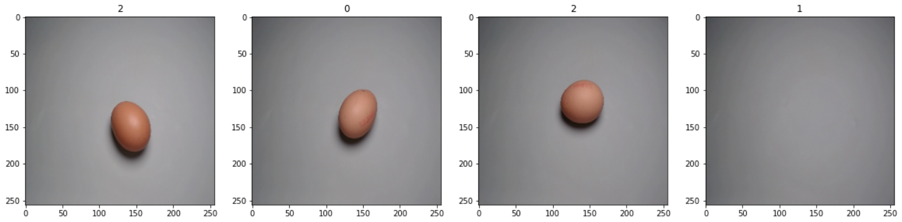
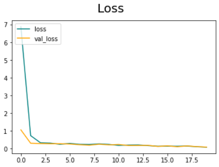
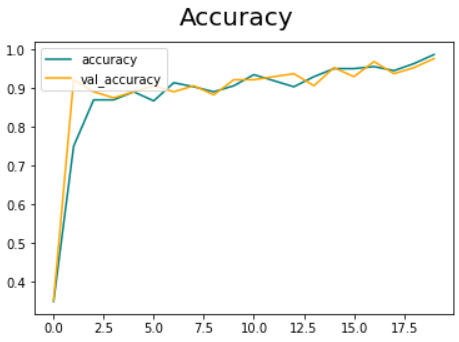

# **Clasificador de Imágenes**

-----
### Este proyecto va a consistir en el análisis, exploración de datos y creación de un modelo de red neuronal convolucional para la predicción del estado de un huevo(roto, vacio, bueno), Para ello he usado varias herramientas y librerías dentro de Python correspondientes al Deep Learning.


-----

### Organización de carpetas: 

* scr/
    * data/: Contiene los archivos usados en el proyecto.
    
    * Images/: Contiene imágenes usadas en este archivo Markdown.

    * Model/: Contiene los modelos realizados en el proyecto.

    * notebooks/: son archivos jupyter notebook usados en todo el proceso.

------

### Fuente: [Kaggle](https://www.kaggle.com/datasets/frankpereny/broken-eggs)

------

### En este proyecto de pueden apreciar conocimientos en:

* Python
* Deep Learning
* Keras
* TensorFlow
* ImagineProcessing
* Computer Vision
* Supervised Learning
* Classifier Models
* Functional Programming

------

## **Importación de los datos**

#### Creamos un dataset etiquetado con nuestros propios datos para usarlo en el proceso.

#### Con la función `tf.keras.utils.image_dataset_from_directory()` aparte de etiquetarnos los datos automáticamente también nos realiza un preprocesado previo como ajustar el tamaño de todas las imágenes.

```py
data = tf.keras.utils.image_dataset_from_directory('../data/train/')
data_iterator = data.as_numpy_iterator()
batch = data_iterator.next()
batch = data_iterator.next()
batch[1]
array([2, 0, 2, 1, 2, 1, 0, 0, 1, 2, 0, 1, 0, 2, 0, 2, 0, 1, 0, 2, 1, 1,
       1, 1, 2, 2, 2, 0, 2, 0, 0, 2])
fig, ax = plt.subplots(ncols=4, figsize=(20,20))
for idx, img in enumerate(batch[0][:4]):
    ax[idx].imshow(img.astype(int))
    ax[idx].title.set_text(batch[1][idx])
```
#### Como vemos en el `batch[1]` tenemos las etiquetas de cada batch de datos(32 imágenes por cada batch).


## **Escalamos los datos**
```py
data = data.map(lambda x,y: (x/255, y))
scaled_iterator = data.as_numpy_iterator()
batch = scaled_iterator.next()
```

## **Dividimos entre train y test**
```py
train_size = int(len(data)*.7)
val_size = int(len(data)*.2)+1
test_size = int(len(data)*.1)+1
train = data.take(train_size)
val = data.skip(train_size).take(val_size)
```
## **Creamos el modelo de Deep Learning**

#### Tenemos un modelo con una primera capa en la que se le aplica a nuestras imágenes 32 filtros sobre 3x3 píxeles cada 1 pixel, una segunda capa en la que aplicamos 128 filtros sobre 2x2 pixeles cada 1 pixel, luego aplanamos los datos para meterlo en la red neuronal final. Las Pooling layer que usamos son sobre 2x2 pixeles. La capa de salida está compuesto por un espacio de salida de 3 ya que tenemos 3 etiquetas en nuestros datos. He usado como función de activación Relu menos en la capa de salida en la que he usado la función sigmoide. Como optimizador he usado Adam, como función de pérdida "sparse categorical crosssentropy" y como métrica "accuracy".
```py
capas = [
    keras.layers.Conv2D(32, (3,3), activation = "relu", input_shape = (256,256,3)),
    keras.layers.MaxPool2D(pool_size = (2,2)),
    keras.layers.Conv2D(128, (3,3), activation = "relu", input_shape = (32,32,3)),
    keras.layers.MaxPool2D(pool_size = (2,2)),
    keras.layers.Flatten(),
    keras.layers.Dense(128, activation = "relu"),
    keras.layers.Dense(6, activation = "sigmoid")
]
modelo = keras.Sequential(capas)
modelo.compile(optimizer = "adam", 
                loss = "sparse_categorical_crossentropy", 
                metrics = ["accuracy"])
```
## **Entrenamos el modelo**
#### con la función `tf.keras.callbacks.TensorBoard()` vamos a guardar los datos de entrenamiento en un archivo que luego podemos volver a consultar cuando queramos.

```py
tensorboard_callback = tf.keras.callbacks.TensorBoard(log_dir=logdir)
hist = modelo.fit(train, epochs=20, validation_data=val, callbacks=[tensorboard_callback])
```

## **Comprobación**
#### Vamos a comprobar el comportamiento del modelo durante el entrenamiento.

#### Comprobamos como avanzó la función de perdida en el entrenamiento y vemos como fue disminuyendo cada vez más. Si nos encontráramos que aumenta la función de pérdida deberíamos comprobar la arquitectura del modelo o volver a comprobar la forma de nuestros datos.

#### Comprobamos como avanzó la precisión de nuestro modelo y vemos como fue en aumento. Podemos ver como es un muy buen modelo.


## **Evaluación**
#### Evaluamos el modelo y vemos que tiene bastante precisión.
```py
for batch in test.as_numpy_iterator():
    x, y = batch
    yhat = modelo.predict(x)
    print(metrics.accuracy_score(np.argmax(modelo.predict(x), axis = 1), y))

1/1 [==============================] - 0s 412ms/step
1/1 [==============================] - 0s 387ms/step
1.0
1/1 [==============================] - 0s 328ms/step
1/1 [==============================] - 0s 335ms/step
0.96
```
## **Guardamos el modelo**

```py
from tensorflow.keras.models import load_model
modelo.save(os.path.join('../model','imageclassifier.h5'))
```
